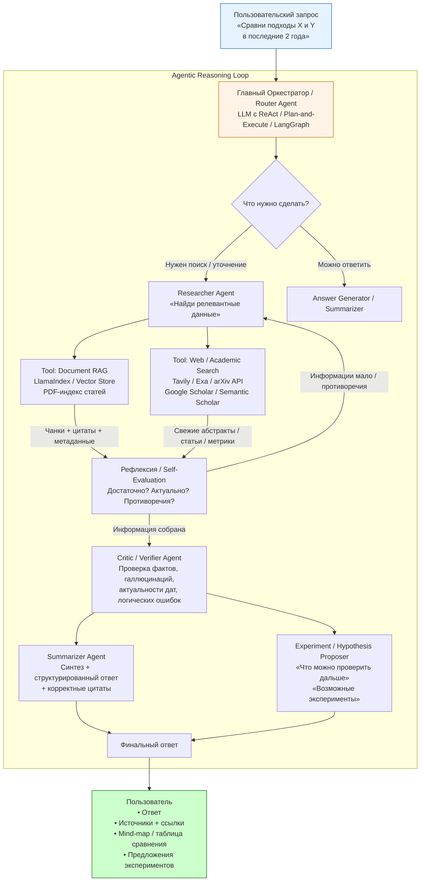

# Agentic-RAG-Research-Assistant
## Architecture Agentic RAG Research Assistant

```mermaid
graph TD
    A[Пользовательский запрос<br>«Сравни подходы X и Y<br>в последние 2 года»] --> B[Главный Оркестратор / Router Agent<br>LLM с ReAct / Plan-and-Execute / LangGraph]

    subgraph "Agentic Reasoning Loop"
        B --> C{Что нужно сделать?}

        C -->|Нужен поиск / уточнение| D[Researcher Agent<br>«Найди релевантные данные»]
        C -->|Можно ответить| E[Answer Generator / Summarizer]

        D --> F[Tool: Document RAG<br>LlamaIndex / Vector Store<br>PDF-индекс статей]
        D --> G[Tool: Web / Academic Search<br>Tavily / Exa / arXiv API<br>Google Scholar / Semantic Scholar]

        F -->|Чанки + цитаты + метаданные| H[Рефлексия / Self-Evaluation<br>Достаточно? Актуально? Противоречия?]
        G -->|Свежие абстракты / статьи / метрики| H

        H -->|Информации мало / противоречия| D
        H -->|Информация собрана| I[Critic / Verifier Agent<br>Проверка фактов, галлюцинаций,<br>актуальности дат, логических ошибок]

        I --> J[Summarizer Agent<br>Синтез + структурированный ответ<br>+ корректные цитаты]
        I --> K[Experiment / Hypothesis Proposer<br>«Что можно проверить дальше»<br>«Возможные эксперименты»]

        J --> L[Финальный ответ]
        K --> L
    end

    L --> M[Пользователь<br>• Ответ<br>• Источники + ссылки<br>• Mind-map / таблица сравнения<br>• Предложения экспериментов]

    style A fill:#e6f3ff,stroke:#0066cc
    style M fill:#ccffcc,stroke:#006600
    style B fill:#fff3e6,stroke:#cc6600
```
