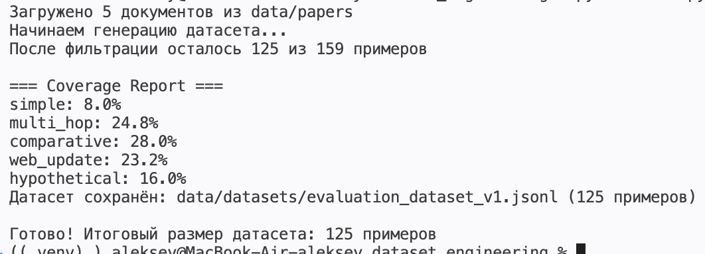

# Evaluation Dataset Generator для Agentic RAG Research Assistant

**Инструмент для создания высококачественного оценочного датасета** для многоагентной RAG-системы.

Данный генератор позволяет автоматически создавать сбалансированный датасет для комплексной оценки Agentic RAG-системы: от простых вопросов до сложных multi-hop, comparative и agentic-запросов, требующих веб-поиска.

---

## Основные возможности
 
- Генерация вопросов 5 категорий сложности:
  - `simple` — простые вопросы
  - `multi_hop` — многошаговые вопросы
  - `comparative` — вопросы на сравнение
  - `web_update` — вопросы, требующие свежих данных
  - `hypothetical` — гипотетические и exploratory вопросы
- LLM-as-Judge фильтрация низкокачественных примеров
- Контроль распределения по категориям

---

## Цель проекта

Создание **реалистичного, разнообразного и сбалансированного** оценочного датасета для тестирования и улучшения Agentic RAG Research Assistant — системы, способной работать с PDF-статьями и проводить глубокий исследовательский анализ.

---

## Технологический стек

- **Python 3.11+**
- **LlamaIndex**
- **LangChain**
- **JSON structured output**
- **LLM-as-Judge**

---

## Структура проекта

```bash
dataset-generator/
├── main.py                    # Основной скрипт запуска
├── config.py                  # Настройки и пропорции
├── ingestion.py               # Загрузка PDF
├── generators.py              # Генераторы вопросов
├── filters.py                 # Фильтрация качества
├── evaluators.py              # Расчёт покрытия
├── data/
│   └── papers/                # PDF-статьи
├── generated/
│   └── evaluation_dataset_v1.jsonl
└── README.md

Вывод:



Пример структуры evaluation_dataset_v1:
{"id": "1522d4ae-7d4b-435b-a439-ebecbb602715", "category": "simple", "category_number": 2, "global_number": null, "question": "Перечислите всех авторов исследования, указанных в документе.", "domain": "AI/ML", "language": "en"}
{"id": "57b9d20b-df64-4ad8-80af-7b086ce02a79", "category": "simple", "category_number": 4, "global_number": null, "question": "Какая лицензия применяется к данному документу?", "domain": "AI/ML", "language": "en"}
{"id": "7992dca8-a793-4fad-bd2f-e0316e2a8591", "category": "simple", "category_number": 6, "global_number": null, "question": "К какой предметной области, согласно классификации arXiv, относится данная работа?", "domain": "AI/ML", "language": "en"}
{"id": "353c2ebe-5de6-47e5-979b-03d1237d148c", "category": "simple", "category_number": 20, "global_number": null, "question": "В какой научной категории (subject category) классифицируется эта работа согласно метаданным?", "domain": "AI/ML", "language": "en"}
{"id": "1a4afdac-1ae7-4d2c-8444-1382a23b00d3", "category": "simple", "category_number": 27, "global_number": null, "question": "К какому научному предметному разделу (category) отнесена работа согласно метаданным?", "domain": "AI/ML", "language": "en"}
{"id": "3e27c8c4-fe7f-495d-950a-c91cd6431fcb", "category": "simple", "category_number": 28, "global_number": null, "question": "Какой инструмент был использован для создания PDF-версии данного документа?", "domain": "AI/ML", "language": "en"}
{"id": "8899be8c-3d60-47ad-9cd0-318bfbbfc760", "category": "simple", "category_number": 29, "global_number": null, "question": "Какой тип данных является входным условием для генерации 3D-мира в методе Map2World?", "domain": "AI/ML", "language": "en"}
{"id": "c5a9a916-81ba-4b7e-8b8d-5c96b64be6e8", "category": "simple", "category_number": 30, "global_number": null, "question": "Каков полный заголовок исследовательской работы, представленной в данном документе?", "domain": "AI/ML", "language": "en"}
{"id": "149540d8-a25a-4507-8fd1-52390d0df762", "category": "simple", "category_number": 33, "global_number": null, "question": "Какой постоянный идентификатор DOI присвоен данному документу?", "domain": "AI/ML", "language": "en"}
